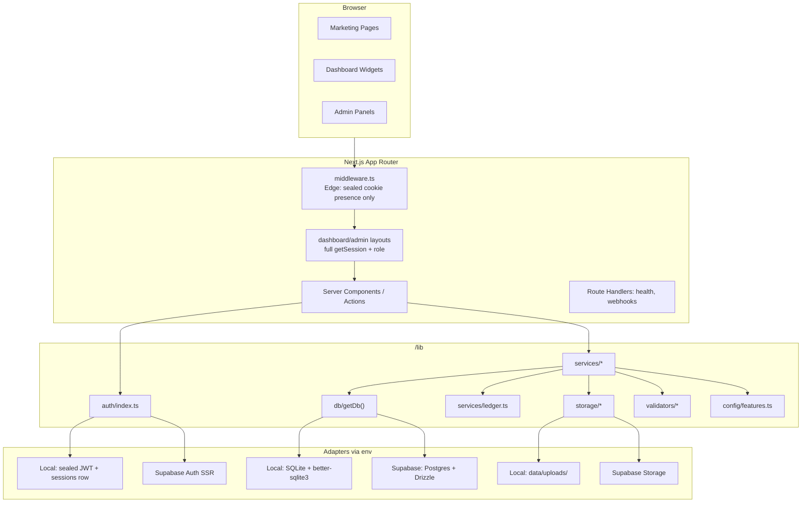
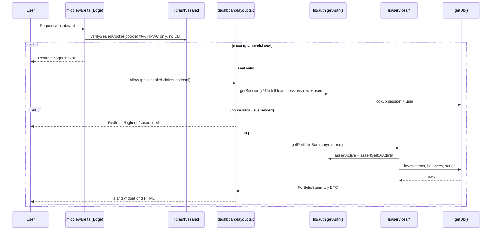
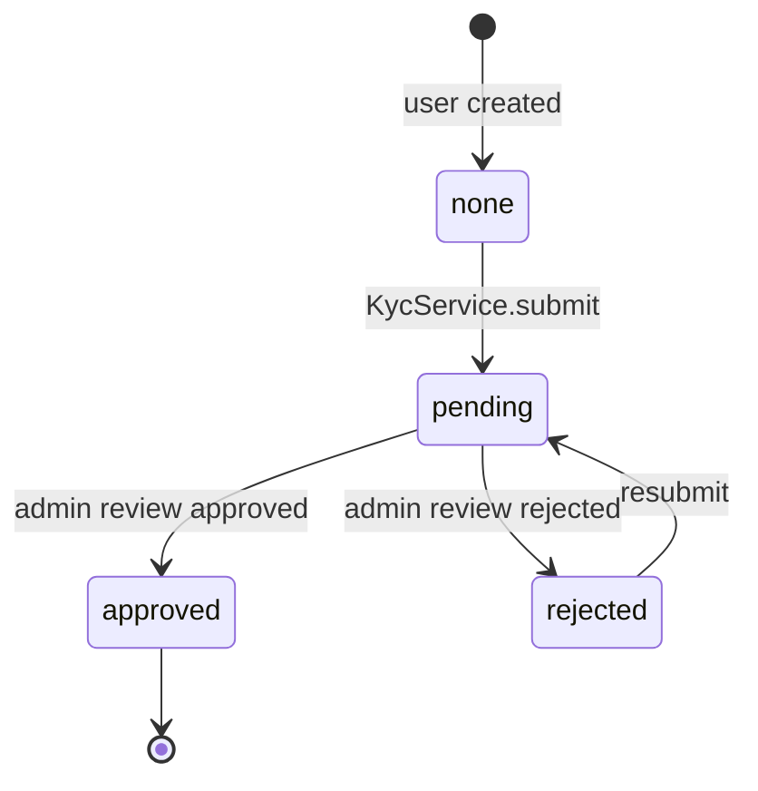
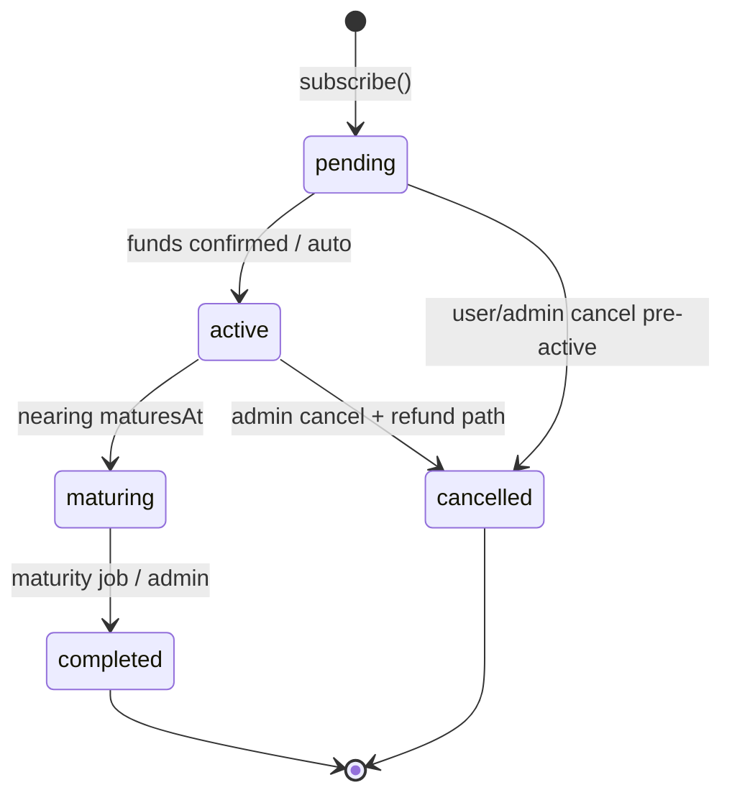
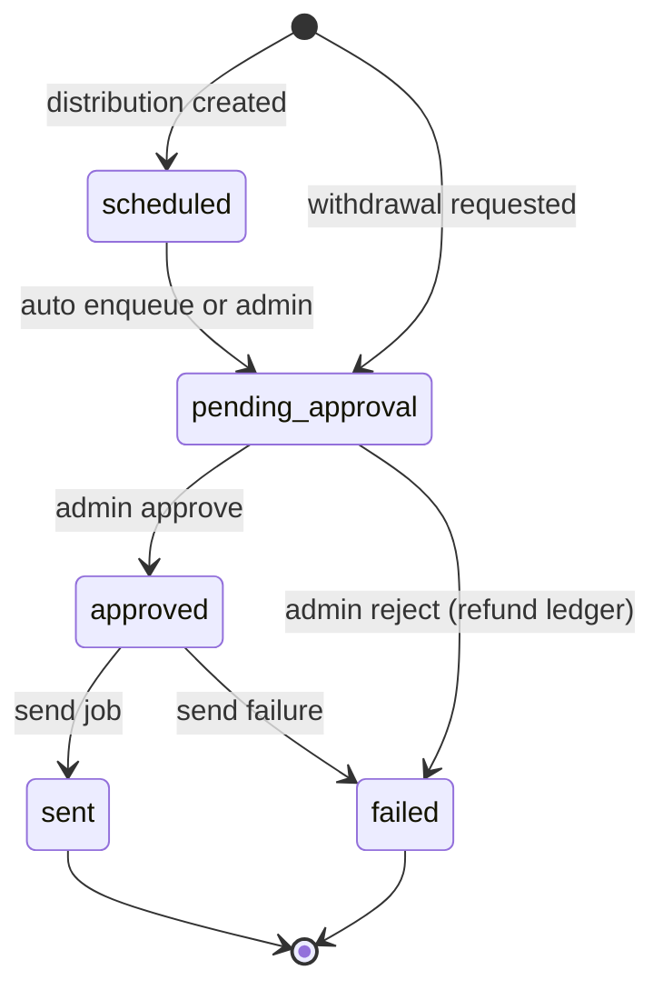
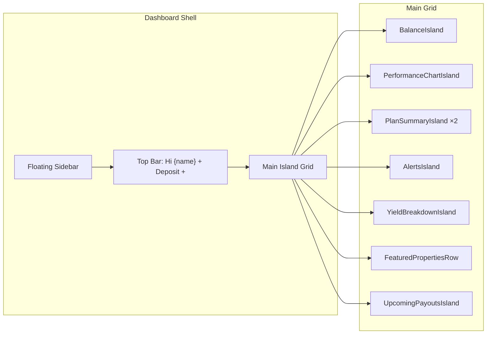
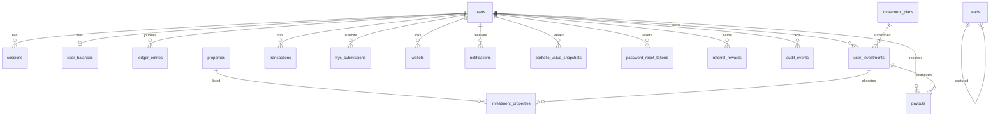
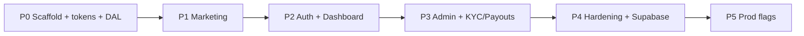
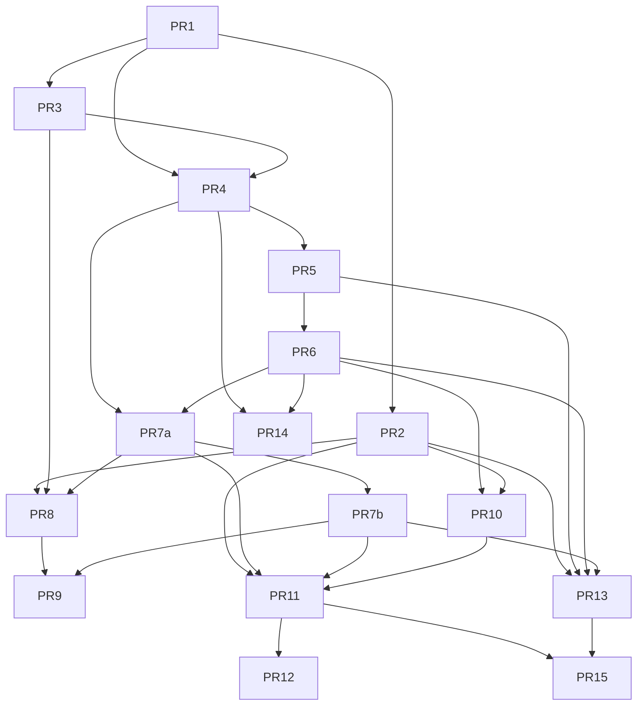

# QuidMotion — Full Website / Platform Design

| Field | Value |
|---|---|
| **Document** | Platform Architecture & Design Specification |
| **Author** | TBD |
| **Approver** | Product owner — confirm OQ1–OQ4 before PR 8 visual lock ☐ |
| **Date** | 2026-07-28 |
| **Status** | Draft (Revision 2 — review issues addressed) |
| **Revision** | R2 |
| **Workspace** | `D:\QuidMotion` |
| **Stack** | Next.js (App Router) · TypeScript · Tailwind · Drizzle · Supabase · Vercel |

---

## Overview

QuidMotion is a multi-page investment platform that pairs institutional-grade real estate expertise with cryptocurrency rails, allowing everyday users to deposit crypto, select investment plans, and earn returns from professionally managed property deals. The brand tone is confident, premium, and trustworthy — modern fintech polish (Robinhood / Wealthfront) with boutique fund credibility, never "crypto bro."

This document specifies a **greenfield** implementation of the complete platform: marketing site, authenticated user dashboard, admin panel, local-first data access layer (SQLite → Supabase), modular service architecture, island-style design system, cash ledger & balances, security model (hybrid Edge middleware + service authz + sample RLS), observability, rollout plan, and an ordered PR implementation strategy. There is no existing application code; the workspace currently holds only the product brief and a dashboard visual reference.

---

## Background & Motivation

### Problem

Retail investors face high barriers to real estate: large minimums, illiquidity, paperwork, and geographic limits. Crypto-native users hold capital that can move instantly but lack trusted vehicles into real assets. QuidMotion bridges these worlds.

### Current State

- Workspace `D:\QuidMotion` contains only:
  - `QuidMotion-Design-Prompt.md` — product/tech brief
  - `dashboard design idea 1.jpg` — "Fierce" fintech dashboard visual reference (island layout over blurred interior photo)
- **No application code, schema, or infrastructure exists.**

### Pain Points the Architecture Must Solve

1. **Local-first development** — engineers must build and demo offline without a live Supabase project.
2. **Provider swap without app rewrites** — migrating local SQLite → Supabase Postgres is env-config for application code; schema modules are dual-maintained with parity tests (see Key Decision KD2).
3. **Monolith prevention** — every page, widget, and business rule must be independently swappable and testable.
4. **Auth parity** — local mock-auth and Supabase Auth must share one interface so routes stay identical; Edge middleware uses sealed cookies only (no SQLite on Edge).
5. **Authorization dual-enforcement** — service-layer checks always (local "RLS-equivalent"); Supabase RLS as defense-in-depth in production.


---

## Goals & Non-Goals

### Goals

| # | Goal |
|---|---|
| G1 | Ship a complete multi-page platform (marketing, auth, dashboard, documents, admin) |
| G2 | Enforce modular architecture: UI primitives → composed sections → services → DAL |
| G3 | Local-first DAL with `DB_PROVIDER=local\|supabase` switch; **shared column defs + dual dialect table modules** (env-only for app code; schema modules dual-maintained) |
| G4 | Auth abstraction with sealed-cookie Edge gate + full session in Server Components; local ↔ Supabase swap |
| G5 | Island fluid UI (glass panels, spring motion, dark-mode-first) matching dashboard reference mapping |
| G6 | Design-token-driven styling; no hardcoded hex/magic numbers in components |
| G7 | Role-gated admin with hybrid middleware + layout gates + service authorization |
| G8 | Seed script with realistic fake data; `MIGRATION.md` for local → Supabase |
| G9 | Feature flags for crypto feeds, lead magnet, referrals, etc. |
| G10 | Performance budgets for marketing vs dashboard surfaces |
| G11 | Append-only cash ledger + materialized balances; integer cents everywhere |
| G12 | Explicit KYC / investment / payout state machines with service-enforced gates |

### Non-Goals

| # | Non-Goal |
|---|---|
| NG1 | Real on-chain wallet integration, smart contracts, or custody |
| NG2 | Mobile native apps (responsive web only for v1) |
| NG3 | Multi-tenant white-label / B2B SaaS packaging |
| NG4 | Product packaging |
| NG5 | Real-time multiplayer / collaborative admin |
| NG6 | i18n beyond English (structure for later; ship en-US) |
| NG7 | GraphQL or tRPC layer (use Next.js Server Actions + thin service calls) |
| NG8 | SQLite Row-Level Security (local authz is **service-layer only**) |

---

## Proposed Design

### High-Level Architecture



### Folder Structure

```
/
├── app/
│   ├── (marketing)/
│   │   ├── layout.tsx                 # marketing shell (nav + footer)
│   │   ├── page.tsx                   # Home
│   │   ├── about/page.tsx
│   │   ├── plans/page.tsx
│   │   ├── faq/page.tsx
│   │   └── documents/
│   │       ├── page.tsx
│   │       └── [slug]/page.tsx
│   ├── login/page.tsx
│   ├── register/page.tsx
│   ├── forgot-password/page.tsx
│   ├── reset-password/page.tsx        # token from email link
│   ├── dashboard/
│   │   ├── layout.tsx                 # full session load + suspended check
│   │   ├── page.tsx                   # overview widget grid
│   │   ├── investments/page.tsx
│   │   ├── deposit/page.tsx
│   │   ├── withdraw/page.tsx
│   │   ├── transactions/page.tsx
│   │   ├── referrals/page.tsx         # feature-flagged
│   │   ├── properties/page.tsx
│   │   └── settings/page.tsx
│   ├── admin/
│   │   ├── layout.tsx                 # full session + admin role
│   │   ├── page.tsx
│   │   ├── users/page.tsx
│   │   ├── kyc/page.tsx
│   │   ├── plans/page.tsx
│   │   ├── payouts/page.tsx
│   │   ├── content/page.tsx
│   │   └── audit/page.tsx
│   ├── api/
│   │   └── health/route.ts
│   ├── layout.tsx
│   └── globals.css
├── components/
│   ├── ui/
│   ├── marketing/
│   ├── dashboard/
│   ├── admin/
│   └── shared/                        # AuthForm, ThemeToggle, InvestmentDisclaimer, RiskCallout
├── content/
│   └── documents/
│       ├── terms.mdx
│       ├── privacy.mdx
│       ├── risk-disclosure.mdx
│       └── aml-kyc.mdx
├── lib/
│   ├── db/
│   │   ├── index.ts                   # getDb() lazy factory; import 'server-only'
│   │   ├── types.ts
│   │   ├── schema/
│   │   │   ├── columns.ts             # shared column builders / field defs
│   │   │   ├── schema.sqlite.ts       # sqliteTable wrappers
│   │   │   ├── schema.pg.ts           # pgTable wrappers
│   │   │   └── index.ts               # re-exports by DB_PROVIDER
│   │   ├── adapters/
│   │   │   ├── local.ts
│   │   │   └── supabase.ts
│   │   └── migrate.ts
│   ├── auth/
│   │   ├── index.ts                   # getAuth() lazy; import 'server-only'
│   │   ├── types.ts
│   │   ├── sealed.ts                  # Edge-safe JWT/HMAC mint + verify (no DB)
│   │   ├── adapters/
│   │   │   ├── local.ts
│   │   │   └── supabase.ts
│   │   └── session.ts
│   ├── storage/
│   │   ├── index.ts
│   │   ├── types.ts
│   │   └── adapters/
│   │       ├── local.ts               # data/uploads/
│   │       └── supabase.ts
│   ├── services/
│   │   ├── users.ts
│   │   ├── investments.ts
│   │   ├── payouts.ts
│   │   ├── transactions.ts
│   │   ├── properties.ts
│   │   ├── documents.ts
│   │   ├── faq.ts
│   │   ├── crypto.ts
│   │   ├── stats.ts
│   │   ├── kyc.ts
│   │   ├── referrals.ts
│   │   ├── notifications.ts
│   │   ├── ledger.ts
│   │   ├── leads.ts
│   │   ├── audit.ts
│   │   └── _authz.ts                  # assertAdmin, assertSelfOrAdmin, assertActive, assertKyc
│   ├── hooks/
│   ├── validators/
│   ├── money.ts                       # cents helpers: toCents, fromCents, formatUsd
│   └── config/
│       ├── tokens.ts
│       ├── site.ts
│       └── features.ts
├── data/                              # gitignored; quidmotion.db, uploads/
├── scripts/
│   ├── seed.ts
│   └── migrate-to-supabase.ts
├── tests/
│   ├── unit/services/
│   ├── integration/dal/
│   ├── contract/                      # authAdapter, schemaParity
│   └── fixtures/
├── MIGRATION.md
├── .env.example
├── drizzle.config.ts
├── tailwind.config.ts
├── next.config.ts
└── package.json
```

### Request Lifecycle (Hybrid Auth)

**Key Decision KD1:** Edge middleware never touches SQLite or Argon2. It only verifies a **signed sealed session cookie** (HMAC-JWT, Edge-safe). Full session load (DB row, role, KYC, suspended) happens in Server Component layouts and Server Actions.



**Cookie contract (both adapters):**
| Cookie | Runtime | Contents | Purpose |
|---|---|---|---|
| `qm_seal` | Edge-safe | JWT/HMAC: `{ sub, role, exp, sid }` signed with `SESSION_SECRET` | Middleware presence + coarse role for `/admin` redirect |
| `qm_session` (local) or Supabase SSR cookies | Node/Server only | Opaque token (local) or Supabase session | Full session resolution via DB / Supabase |

**Local adapter mint path:**
1. Validate credentials (Argon2 against `users.passwordHash`).
2. Insert revocable row in `sessions` (`tokenHash`, `expiresAt`).
3. Set `qm_session` = opaque token (httpOnly, Secure, SameSite=Lax).
4. Set `qm_seal` = signed JWT with `sub`, `role`, `sid`, `exp` matching session TTL.

**Local adapter revoke path:** delete/expire `sessions` row; clear both cookies. Seal alone is insufficient after revoke — layouts always re-check DB.

**Supabase adapter:** `@supabase/ssr` cookie verification is Edge-safe for middleware; layouts use `getSession()` → map `auth.users.id` = `users.id` (no separate `user_profiles` table).

### Data Access Layer (DAL)

**Lazy single entry point** — never eager-init at import; never `require()`.

```typescript
// lib/db/index.ts
import 'server-only';
import type { DbAdapter, AppDatabase } from './types';

let _adapter: DbAdapter | null = null;

/** Injectable seam for tests — call resetDbForTests() between cases. */
export function setDbAdapterForTests(adapter: DbAdapter | null): void {
  _adapter = adapter;
}

export function getDbAdapter(): DbAdapter {
  if (_adapter) return _adapter;
  const provider = process.env.DB_PROVIDER ?? 'local';
  if (provider === 'supabase') {
    // static conditional import pattern — bundler keeps both; only one constructed
    const { createSupabaseAdapter } = requireAdapter('supabase');
    _adapter = createSupabaseAdapter();
  } else {
    const { createLocalAdapter } = requireAdapter('local');
    _adapter = createLocalAdapter();
  }
  return _adapter;
}

export function getDb(): AppDatabase {
  return getDbAdapter().db;
}

// Prefer explicit dynamic import helpers over Node require():
async function loadLocal() {
  return import('./adapters/local');
}
async function loadSupabase() {
  return import('./adapters/supabase');
}

// Sync path for Server Components: use a small factory map with static imports
// so Turbopack/webpack can analyze. Pattern:
import * as localAdapter from './adapters/local';
import * as supabaseAdapter from './adapters/supabase';

function requireAdapter(provider: 'local' | 'supabase') {
  return provider === 'supabase' ? supabaseAdapter : localAdapter;
}
```

**Rules:**
- Every file under `lib/db/**` and `lib/auth/adapters/**` starts with `import 'server-only'`.
- Client components **never** import `lib/db`, `lib/auth` adapters, or services that pull them — only Server Components, Server Actions, and Route Handlers.
- Tests inject via `setDbAdapterForTests({ provider: 'local', db: testDb })`.

```typescript
// lib/db/types.ts
import type { BetterSQLite3Database } from 'drizzle-orm/better-sqlite3';
import type { PostgresJsDatabase } from 'drizzle-orm/postgres-js';
import type * as schema from './schema';

export type AppDatabase =
  | BetterSQLite3Database<typeof schema>
  | PostgresJsDatabase<typeof schema>;

export interface DbAdapter {
  readonly provider: 'local' | 'supabase';
  readonly db: AppDatabase;
  migrate?(): Promise<void>;
  close?(): Promise<void>;
}
```

**Local adapter** (`DB_PROVIDER=local`, default):
- File: `DB_PATH` or `/data/quidmotion.db` (gitignored)
- Driver: `better-sqlite3` (Node server only — never Edge)
- Drizzle: `drizzle-orm/better-sqlite3`
- On first boot: apply migrations from `drizzle/sqlite/`

**Supabase adapter** (`DB_PROVIDER=supabase`):
- Connection: `DATABASE_URL` (pooler)
- Drizzle: `drizzle-orm/postgres-js` + `postgres`
- Auth/Storage via `@supabase/supabase-js` in `lib/auth` and `lib/storage` — **not** mixed into query DAL

### Dual-Dialect Schema Strategy (KD2)

**Problem:** `sqliteTable` ≠ `pgTable`. A single `schema.ts` using only SQLite builders is not drop-in for Postgres.

**Solution:** Shared column *definitions* + thin dialect wrappers. App code imports from `lib/db/schema` which re-exports the active dialect. **Env-only runtime switch is true for application code** (services, pages). Schema *modules* are dual-maintained; CI runs schema parity tests.

```
lib/db/schema/
  columns.ts        # pure field name/type intent (no table builder)
  schema.sqlite.ts  # sqliteTable(...) using columns
  schema.pg.ts      # pgTable(...) using columns
  index.ts          # export * from sqlite | pg based on DB_PROVIDER at build/test time
```

```typescript
// lib/db/schema/columns.ts — shared intent
export const userColumns = {
  id: { name: 'id', kind: 'textPk' as const },
  email: { name: 'email', kind: 'text' as const, unique: true, notNull: true },
  name: { name: 'name', kind: 'text' as const, notNull: true },
  passwordHash: { name: 'password_hash', kind: 'text' as const }, // null in Supabase prod
  role: { name: 'role', kind: 'textEnum' as const, values: ['user', 'admin', 'support'] as const },
  kycStatus: { name: 'kyc_status', kind: 'textEnum' as const, values: ['none', 'pending', 'approved', 'rejected'] as const },
  status: { name: 'status', kind: 'textEnum' as const, values: ['active', 'suspended'] as const },
  // ... remaining fields
};

// lib/db/schema/schema.sqlite.ts
import { sqliteTable, text, integer } from 'drizzle-orm/sqlite-core';

export const users = sqliteTable('users', {
  id: text('id').primaryKey(),
  email: text('email').notNull().unique(),
  name: text('name').notNull(),
  passwordHash: text('password_hash'), // null when identity is Supabase-only
  role: text('role', { enum: ['user', 'admin', 'support'] }).notNull().default('user'),
  kycStatus: text('kyc_status', { enum: ['none', 'pending', 'approved', 'rejected'] }).notNull().default('none'),
  status: text('status', { enum: ['active', 'suspended'] }).notNull().default('active'),
  avatarUrl: text('avatar_url'),
  referralCode: text('referral_code').notNull().unique(),
  referredBy: text('referred_by'),
  createdAt: text('created_at').notNull(),
  updatedAt: text('updated_at').notNull(),
});

// lib/db/schema/schema.pg.ts
import { pgTable, text, timestamp, integer } from 'drizzle-orm/pg-core';

export const users = pgTable('users', {
  id: text('id').primaryKey(), // = auth.users.id in production
  email: text('email').notNull().unique(),
  name: text('name').notNull(),
  passwordHash: text('password_hash'), // always null in prod; Supabase owns credentials
  role: text('role').notNull().default('user'),
  kycStatus: text('kyc_status').notNull().default('none'),
  status: text('status').notNull().default('active'),
  avatarUrl: text('avatar_url'),
  referralCode: text('referral_code').notNull().unique(),
  referredBy: text('referred_by'),
  createdAt: text('created_at').notNull(), // keep text ISO for parity; or timestamptz + adapter map
  updatedAt: text('updated_at').notNull(),
});
```

**Parity rules:**
- Same table names, column names, and semantics on both dialects.
- Booleans: SQLite `integer({ mode: 'boolean' })`; PG `boolean` — wrapper normalizes.
- JSON: always `text` storing `JSON.stringify` (both dialects) for v1 simplicity.
- Money: always `integer` **cents** (never `real` / float).
- UUIDs: `text` PKs from `crypto.randomUUID()`.
- `tests/contract/schemaParity.test.ts`: assert both modules export identical table/column name sets.

**G3 clarification:** "No code changes to migrate" means **application** code (services, actions, pages) does not branch on provider. Schema dual files and adapter selection are the supported seam; `MIGRATION.md` documents any PG-only index/RLS SQL.

### Auth Abstraction

```typescript
// lib/auth/types.ts
export type Role = 'user' | 'admin' | 'support';

/** v1 policy: support ≡ user for authorization (no admin routes, no extra asserts). */
export function isAdmin(role: Role): boolean {
  return role === 'admin';
}

export interface AuthUser {
  id: string;
  email: string;
  name: string;
  role: Role;
  kycStatus: 'none' | 'pending' | 'approved' | 'rejected';
  status: 'active' | 'suspended';
  avatarUrl?: string | null;
  createdAt: string;
}

export interface Session {
  user: AuthUser;
  expiresAt: string;
  sessionId: string;
}

export interface Credentials {
  email: string;
  password: string;
}

export interface RegisterInput extends Credentials {
  name: string;
  referralCode?: string;
}

export interface AuthAdapter {
  register(input: RegisterInput): Promise<Session>;
  login(input: Credentials): Promise<Session>;
  logout(): Promise<void>;
  getSession(): Promise<Session | null>;
  /**
   * Edge-safe: verify sealed cookie signature only.
   * Does NOT hit DB. Returns coarse claims or null.
   */
  verifySealedCookie(cookieHeader: string | null): Promise<{ sub: string; role: Role; sid: string; exp: number } | null>;
  /** Server-only full resolve (DB or Supabase SSR). */
  getSessionFromCookies(cookieHeader: string | null): Promise<Session | null>;
  requestPasswordReset(email: string): Promise<void>;
  resetPassword(token: string, newPassword: string): Promise<void>;
  setRole?(userId: string, role: Role): Promise<void>;
}
```

```typescript
// lib/auth/index.ts
import 'server-only';
import type { AuthAdapter } from './types';
import * as localAuth from './adapters/local';
import * as supabaseAuth from './adapters/supabase';

let _auth: AuthAdapter | null = null;

export function setAuthForTests(adapter: AuthAdapter | null): void {
  _auth = adapter;
}

export function getAuth(): AuthAdapter {
  if (_auth) return _auth;
  const provider = process.env.AUTH_PROVIDER ?? process.env.DB_PROVIDER ?? 'local';
  _auth =
    provider === 'supabase'
      ? supabaseAuth.createSupabaseAuth()
      : localAuth.createLocalAuth();
  return _auth;
}

/** @deprecated Prefer getAuth() — kept as lazy getter alias for call sites. */
export const auth = {
  get register() { return (...a: Parameters<AuthAdapter['register']>) => getAuth().register(...a); },
  // …or simply always call getAuth() at use sites
};
```

**Edge-safe sealed module** (`lib/auth/sealed.ts` — no `server-only`, no Node natives):
- Uses Web Crypto HMAC-SHA256 or `jose` to sign/verify JWT.
- Secret: `SESSION_SECRET` (min 32 chars).
- Claims: `sub` (userId), `role`, `sid` (session id), `exp`.

**Local auth adapter:**
- Passwords: **Argon2id** (`ARGON2_MEMORY_COST`, etc. from env; sensible defaults)
- Sessions table + opaque `qm_session` + sealed `qm_seal`
- Token at rest hashed (SHA-256)
- **Password reset:** insert `password_reset_tokens` (id, userId, tokenHash, expiresAt, usedAt); TTL **1 hour**; single-use; log full reset URL to **dev console** (`[auth] reset link: …`); optional `SMTP_URL` / Ethereal later
- **Rate limits (v1 mock):** in-memory / DB bucket per IP+email: login 10/15m, register 5/h, reset 3/h; return generic errors

**Supabase auth adapter:**
- Wraps `@supabase/ssr`
- Maps Supabase user + **`users` row** (same id) → `AuthUser`
- `passwordHash` always null; credentials live in `auth.users`
- Password reset: `resetPasswordForEmail` with `NEXT_PUBLIC_SITE_URL/reset-password` callback
- **No `user_profiles` table** — `users` is the single app profile table (KD4)

### Money Model — Integer Cents + Ledger (KD3, KD8)

**All monetary amounts are integer USD cents** in DB, services, and DTOs. Display converts at the edge via `lib/money.ts`.

```typescript
// lib/money.ts
export type Cents = number & { readonly __brand: 'Cents' };

export function toCents(usd: number): Cents {
  return Math.round(usd * 100) as Cents;
}
export function fromCents(cents: Cents | number): number {
  return cents / 100;
}
export function formatUsd(cents: Cents | number, locale = 'en-US'): string {
  return new Intl.NumberFormat(locale, { style: 'currency', currency: 'USD' }).format(fromCents(cents));
}
```

**Tables:**

| Table | Role |
|---|---|
| `ledger_entries` | Append-only journal of every balance-affecting event |
| `user_balances` | Materialized `availableCents` + `lockedCents` per user (USD accounting) |

```typescript
// ledger_entries (both dialects — integer cents)
// id, userId, type, amountCents, asset, refType, refId, balanceAfterAvailable, balanceAfterLocked, createdAt
// type: deposit_credit | subscribe_debit | lock | unlock | withdraw_debit | payout_credit |
//       fee | adjustment | referral_credit | refund

// user_balances
// userId PK FK users, availableCents, lockedCents, updatedAt
```

**Money path side effects:**

| Action | Ledger | Balances | Other |
|---|---|---|---|
| `simulateDepositConfirm` | `deposit_credit` +amount | available += amount | `transactions` row status=confirmed |
| `subscribe` | `subscribe_debit` −amount; optional `lock` | available −= ; locked += principal | create `user_investments` |
| Investment active (mock accrual) | none on cash (position value only) | locked unchanged | update `currentValueCents`; snapshot portfolio |
| Investment complete / cancel refund | `unlock` + `payout_credit` or `refund` | locked −= ; available += | investment status |
| `requestWithdrawal` | `withdraw_debit` −amount | available −= | create `payouts` type=`withdrawal` |
| Payout `reject` / fail | compensating `adjustment` credit | available += | |
| Referral reward | `referral_credit` | available += | `referral_rewards` row |

**Mock FX (OQ8 — USD accounting only):** BTC/ETH deposits convert to USD cents at `price_snapshots` rate at confirm time; stored `transactions.amountCents` is always USD cents; `asset` records the funding rail.

**Portfolio Value** = `availableCents + lockedCents + sum(active investments currentValueCents − principal already in locked)` — simpler v1 definition:

> **Portfolio Value (cents)** = `user_balances.availableCents + user_balances.lockedCents + unrealizedYieldCents`  
> where `unrealizedYieldCents = sum(currentValueCents − principalCents)` for active investments (principal is in `lockedCents`).

Or equivalently: `available + sum(currentValueCents for active investments)` if subscribe moves principal from available into investment and **clears** locked by transferring to position — **choose one and stick to it:**

**Canonical v1 (KD3):**
1. Deposit → credit **available**.
2. Subscribe → debit **available**, create investment with `principalCents`; principal is **not** double-counted in locked — `lockedCents` reserved for pending withdrawal holds only (optional). **Simpler:** `lockedCents` = sum of principals in non-terminal investments (maintained on subscribe/complete/cancel).
3. Withdraw → debit **available** only (cannot withdraw locked principal before maturity/cancel).
4. Portfolio chart uses `portfolio_value_snapshots`.

### Money & Compliance Workflows (KD6)

#### KYC state machine



**KYC gates (service-enforced):**

| Action | KYC required? |
|---|---|
| Register / login | No |
| Mock deposit (`getDepositInstructions`, `simulateDepositConfirm`) | **No** — allow try-before-KYC |
| `subscribe` | **Yes** — `kycStatus === 'approved'` |
| `requestWithdrawal` | **Yes** — `kycStatus === 'approved'` |
| View dashboard / portfolio | No (read-only OK) |
| Link wallet | No |

On gate failure throw `AppError('KYC_REQUIRED', ...)`.

#### User status

- `getSession()` / layout: if `users.status === 'suspended'` → treat as unauthenticated for dashboard (redirect) and block all mutating services via `assertActive(actorId)`.
- Admin `setStatus(suspended)` revokes sessions (delete `sessions` rows) and is audited.

#### Investment state machine



- **Cancel + refund:** ledger `refund` credits available; investment terminal; audit log. No self-serve cancel after `active` in v1 (admin only).

#### Payout state machine — two types, one table

`payouts.payoutType`: `'withdrawal' | 'distribution'`

| Type | Created by | investmentId | Meaning |
|---|---|---|---|
| `withdrawal` | `requestWithdrawal` | null | User cash-out of **available** balance |
| `distribution` | maturity job / admin | set | Investment return / principal release |



- **Who transitions?** Admin for `pending_approval → approved|failed`. `scheduled → pending_approval` can be cron/mock job or admin "Release due." `approved → sent` is mock async (immediate in dev).
- Rejected withdrawal: ledger compensating credit to available.

### StorageAdapter

```typescript
// lib/storage/types.ts
export interface StorageAdapter {
  readonly provider: 'local' | 'supabase';
  /** Returns storage key/path. */
  put(opts: {
    userId: string;
    category: 'kyc' | 'other';
    filename: string;
    bytes: Buffer | Uint8Array;
    contentType: string;
  }): Promise<{ path: string }>;
  getSignedUrl?(path: string, ttlSec: number): Promise<string>;
  delete?(path: string): Promise<void>;
}

// Limits (KycService.submit)
// - max 5 files per submission
// - max 10 MB each
// - allowlist: image/jpeg, image/png, application/pdf
// - virus-scan: stub no-op interface ScanAdapter for later
```

- Local: write under `STORAGE_LOCAL_PATH` default `data/uploads/` (gitignored); paths stored as relative keys.
- Supabase: Storage bucket `kyc-docs` private; service role upload; signed URLs for admin review.

### Service Layer Interfaces

Business logic lives **only** in `lib/services/*`. Components and pages never import `getDb()` directly. **No repository layer** — services use `getDb()` + Drizzle queries. Authorization helpers live in `lib/services/_authz.ts` (not a fictional `usersRepo`).

```typescript
// lib/services/_authz.ts
import { getDb } from '@/lib/db';
import { users } from '@/lib/db/schema';
import { eq } from 'drizzle-orm';
import { AppError } from '@/lib/errors';
import type { AuthUser, Role } from '@/lib/auth/types';
import { isAdmin } from '@/lib/auth/types';

export async function loadUser(userId: string): Promise<AuthUser | null> { /* select from users */ }

export async function assertActive(actorId: string): Promise<AuthUser> {
  const user = await loadUser(actorId);
  if (!user) throw new AppError('UNAUTHENTICATED');
  if (user.status === 'suspended') throw new AppError('FORBIDDEN', 'Account suspended');
  return user;
}

export async function assertAdmin(actorId: string): Promise<AuthUser> {
  const user = await assertActive(actorId);
  if (!isAdmin(user.role)) throw new AppError('FORBIDDEN', 'Admin role required');
  return user;
}

export async function assertSelfOrAdmin(actorId: string, targetUserId: string): Promise<AuthUser> {
  const user = await assertActive(actorId);
  if (actorId === targetUserId) return user;
  if (!isAdmin(user.role)) throw new AppError('FORBIDDEN');
  return user;
}

export async function assertKycApproved(actorId: string): Promise<AuthUser> {
  const user = await assertActive(actorId);
  if (user.kycStatus !== 'approved') throw new AppError('KYC_REQUIRED');
  return user;
}
```

#### Authz matrix (resource × action × rule)

| Service method | Rule |
|---|---|
| `users.getById` | `assertSelfOrAdmin` |
| `users.updateProfile` | self only (or admin) |
| `users.list` / `setStatus` | `assertAdmin` |
| `users.linkWallet` | self |
| `investments.listPlans` / `getPlan` / `projectRoi` | public |
| `investments.create/update/archivePlan` | `assertAdmin` |
| `investments.listUserInvestments` / `getPortfolio*` | `assertSelfOrAdmin` |
| `investments.subscribe` | self + `assertKycApproved` + balance check |
| `payouts.listUpcoming` | `assertSelfOrAdmin` |
| `payouts.requestWithdrawal` | self + KYC + available cents |
| `payouts.listPendingApprovals` / `approve` / `reject` | `assertAdmin` |
| `transactions.list` | `assertSelfOrAdmin` |
| `properties.list` / `get` | public (published); admin sees all |
| `properties.create/update` | `assertAdmin` |
| `crypto.getPrices` | public |
| `crypto.getDepositInstructions` / `simulateDepositConfirm` | self (no KYC) |
| `kyc.submit` / `getStatus` | self |
| `kyc.listQueue` / `review` | `assertAdmin` |
| `documents.list` / `getBySlug` | public |
| `documents.updateContent` | `assertAdmin` |
| `faq.*` read public; write admin |
| `notifications.list` / `markRead` | self |
| `referrals.*` | self; flag-gated |
| `leads.capture` | public + rate limit |
| `stats.getPublicStats` | public |
| `stats.getAdminOverview` | `assertAdmin` |
| `audit.list` | `assertAdmin` |
| `ledger` internals | service-private; no direct external API |

**Local "RLS-equivalent"** means **this service matrix only** — SQLite has no RLS. Production adds Supabase RLS as defense-in-depth (see Security).

#### Service interfaces (extended)

```typescript
// Amounts in interfaces are Cents (integer), named *Cents for clarity.

// lib/services/users.ts
export interface UserProfile extends AuthUser {
  linkedWallets: WalletAddress[];
  totalInvestedCents: number;
  availableCents: number;
  lockedCents: number;
  referralCode: string;
}

export interface UsersService {
  getById(actorId: string, targetId: string): Promise<UserProfile>;
  updateProfile(actorId: string, patch: Partial<Pick<UserProfile, 'name' | 'avatarUrl'>>): Promise<UserProfile>;
  list(actorId: string, query: UserListQuery): Promise<Paginated<UserProfile>>;
  setStatus(actorId: string, targetId: string, status: 'active' | 'suspended'): Promise<void>;
  linkWallet(actorId: string, address: string, asset: CryptoAsset): Promise<WalletAddress>;
}

// lib/services/investments.ts
export interface InvestmentPlan {
  id: string;
  slug: string;
  name: string;
  minInvestmentCents: number;
  apyMin: number;               // fraction e.g. 0.08 — not money
  apyMax: number;
  lockupDays: number;
  riskTier: RiskTier;
  acceptedAssets: CryptoAsset[];
  description: string;
  status: PlanStatus;
  highlight?: string;
}

export interface UserInvestment {
  id: string;
  userId: string;
  planId: string;
  plan?: InvestmentPlan;
  principalCents: number;
  currentValueCents: number;
  roiToDate: number;
  status: 'pending' | 'active' | 'maturing' | 'completed' | 'cancelled';
  startedAt: string;
  maturesAt: string;
  propertyIds: string[];
}

export type TimeRange = '1D' | '7D' | '6M' | 'YTD' | '1Y' | 'All';

export interface SeriesPoint {
  t: string;                    // ISO
  valueCents: number;
  /** Tooltip stacked mini-cards */
  breakdown?: { label: string; valueCents: number; colorToken?: string }[];
}

export interface InvestmentsService {
  listPlans(opts?: { includeArchived?: boolean }): Promise<InvestmentPlan[]>;
  getPlan(slugOrId: string): Promise<InvestmentPlan>;
  createPlan(actorId: string, input: CreatePlanInput): Promise<InvestmentPlan>;
  updatePlan(actorId: string, id: string, patch: Partial<CreatePlanInput>): Promise<InvestmentPlan>;
  archivePlan(actorId: string, id: string): Promise<void>;
  listUserInvestments(actorId: string, userId: string): Promise<UserInvestment[]>;
  subscribe(actorId: string, planId: string, amountCents: number, asset: CryptoAsset): Promise<UserInvestment>;
  getPortfolioSummary(actorId: string, userId: string): Promise<PortfolioSummary>;
  getPerformanceSeries(actorId: string, userId: string, range: TimeRange): Promise<SeriesPoint[]>;
  projectRoi(amountCents: number, planId: string, months: number): Promise<RoiProjection>;
}

// TimeRange → resolution for portfolio_value_snapshots queries / seed density
// 1D  → 15–60 min points for last 24h (seed synthetic intraday)
// 7D  → hourly or 4h points
// 6M  → daily
// YTD → daily from Jan 1
// 1Y  → daily
// All → daily or weekly if span > 2y

// lib/services/payouts.ts
export interface Payout {
  id: string;
  userId: string;
  investmentId: string | null;
  payoutType: 'withdrawal' | 'distribution';
  amountCents: number;
  asset: CryptoAsset;
  destinationAddress?: string | null;
  status: 'scheduled' | 'pending_approval' | 'approved' | 'sent' | 'failed';
  scheduledAt: string;
  processedAt?: string | null;
  reviewedBy?: string | null;
  notes?: string | null;
}

export interface PayoutsService {
  listUpcoming(actorId: string, userId: string): Promise<Payout[]>;
  requestWithdrawal(actorId: string, amountCents: number, asset: CryptoAsset, address: string): Promise<Payout>;
  listPendingApprovals(actorId: string): Promise<Payout[]>;
  approve(actorId: string, payoutId: string): Promise<Payout>;
  reject(actorId: string, payoutId: string, reason: string): Promise<Payout>;
}

// lib/services/transactions.ts
export interface Transaction {
  id: string;
  userId: string;
  type: 'deposit' | 'withdrawal' | 'payout' | 'fee' | 'adjustment' | 'subscribe';
  amountCents: number;
  asset: CryptoAsset;
  status: 'pending' | 'confirmed' | 'failed';
  counterparty?: string | null;
  createdAt: string;
}

export interface TransactionsService {
  list(actorId: string, userId: string, query: TxListQuery): Promise<Paginated<Transaction>>;
  getById(actorId: string, id: string): Promise<Transaction>;
}

// lib/services/properties.ts
export interface Property {
  id: string;
  name: string;
  city: string;
  country: string;
  imageUrl?: string | null;
  status: 'fundraising' | 'active' | 'exited';
  targetRaiseCents: number;
  raisedCents: number;
  summary?: string | null;
}

export interface PropertiesService {
  list(opts?: { status?: Property['status']; limit?: number }): Promise<Property[]>;
  getById(id: string): Promise<Property>;
  create(actorId: string, input: CreatePropertyInput): Promise<Property>;
  update(actorId: string, id: string, patch: Partial<CreatePropertyInput>): Promise<Property>;
}

// lib/services/crypto.ts
export interface CryptoService {
  getPrices(assets?: CryptoAsset[]): Promise<PriceQuote[]>; // priceUsd as display float OK; or priceCents
  getDepositInstructions(actorId: string, asset: CryptoAsset): Promise<DepositInstructions>;
  simulateDepositConfirm(actorId: string, txMockId: string, amountCents: number): Promise<Transaction>;
  // confirm: ledger deposit_credit + tx row + optional notification
}

// lib/services/ledger.ts (internal)
export interface LedgerService {
  creditAvailable(userId: string, amountCents: number, type: LedgerType, ref: Ref): Promise<void>;
  debitAvailable(userId: string, amountCents: number, type: LedgerType, ref: Ref): Promise<void>;
  /** All mutations in a single DB transaction with balance row lock/serialize. */
}

// lib/services/faq.ts
export interface FaqService {
  list(opts?: { category?: string; q?: string }): Promise<FaqEntry[]>;
  upsert(actorId: string, entry: FaqEntryInput): Promise<FaqEntry>;
  remove(actorId: string, id: string): Promise<void>;
}

// lib/services/notifications.ts
export interface AppNotification {
  id: string;
  userId: string;
  type: 'referral' | 'kyc' | 'payout' | 'system' | 'deposit';
  title: string;
  body: string;
  href?: string | null;
  readAt?: string | null;
  createdAt: string;
}

export interface NotificationsService {
  list(actorId: string, opts?: { unreadOnly?: boolean }): Promise<AppNotification[]>;
  markRead(actorId: string, id: string): Promise<void>;
  markAllRead(actorId: string): Promise<void>;
  /** internal */ push(userId: string, n: Omit<AppNotification, 'id' | 'createdAt' | 'readAt'>): Promise<void>;
}

// lib/services/documents.ts
export interface DocumentsService {
  list(): Promise<DocMeta[]>;
  /** Read order: documents_meta.bodyOverride ?? file /content/documents/{slug}.mdx */
  getBySlug(slug: string): Promise<{ meta: DocMeta; mdxSource: string }>;
  /** Admin CMS: DB bodyOverride ONLY — never write MDX files on Vercel. */
  updateContent(actorId: string, slug: string, mdx: string): Promise<DocMeta>;
}

// lib/services/kyc.ts — uses StorageAdapter
export interface KycService {
  submit(actorId: string, files: { path: string; type: string }[]): Promise<KycSubmission>;
  getStatus(actorId: string, userId: string): Promise<KycSubmission | null>;
  listQueue(actorId: string): Promise<KycSubmission[]>;
  review(actorId: string, submissionId: string, decision: 'approved' | 'rejected', notes?: string): Promise<KycSubmission>;
}

// lib/services/referrals.ts
export interface ReferralsService {
  getCode(actorId: string): Promise<string>;
  getRewards(actorId: string): Promise<ReferralRewardsSummary>; // from referral_rewards + ledger
  applyCode(actorId: string, code: string): Promise<void>;
}

// lib/services/leads.ts
export interface LeadsService {
  capture(email: string, source: string, meta?: Record<string, string>): Promise<void>;
}

// lib/services/stats.ts, audit.ts — as before with *Cents fields on money stats
```

### Design System — Tokens

```typescript
// lib/config/tokens.ts
export const tokens = {
  colors: {
    canvas: {
      base: 'hsl(240 10% 4%)',
      elevated: 'hsl(240 8% 8%)',
      overlay: 'hsla(240, 10%, 6%, 0.72)',
    },
    island: {
      bg: 'hsla(240, 6%, 12%, 0.55)',
      border: 'hsla(0, 0%, 100%, 0.08)',
      hover: 'hsla(240, 6%, 16%, 0.65)',
    },
    text: {
      primary: 'hsl(0 0% 98%)',
      secondary: 'hsl(240 5% 64%)',
      muted: 'hsl(240 4% 46%)',
      inverse: 'hsl(240 10% 6%)',
    },
    accent: {
      from: 'hsl(262 83% 58%)',
      to: 'hsl(330 80% 60%)',
      solid: 'hsl(262 83% 58%)',
      soft: 'hsla(262, 83%, 58%, 0.15)',
    },
    success: 'hsl(142 71% 45%)',
    warning: 'hsl(38 92% 50%)',
    danger: 'hsl(0 72% 51%)',
    info: 'hsl(210 90% 55%)',
  },
  radius: {
    sm: '8px',
    md: '12px',
    lg: '16px',
    xl: '20px',
    '2xl': '24px',
    full: '9999px',
  },
  shadow: {
    subtle: '0 1px 2px hsla(0,0%,0%,0.24)',
    elevated: '0 8px 24px hsla(0,0%,0%,0.32)',
    floating: '0 16px 48px hsla(0,0%,0%,0.45)',
  },
  spacing: {
    islandGap: '16px',
    sectionY: '96px',
    pageX: '24px',
  },
  motion: {
    duration: { fast: 150, base: 250, slow: 400 },
    spring: {
      snappy: { type: 'spring', stiffness: 400, damping: 30 },
      smooth: { type: 'spring', stiffness: 260, damping: 28 },
      gentle: { type: 'spring', stiffness: 160, damping: 24 },
    },
  },
  typography: {
    display: 'var(--font-display)',
    body: 'var(--font-body)',
    mono: 'var(--font-mono)',
  },
} as const;
```

**Fonts:** Display **Satoshi** (fallback General Sans); Body **Inter**; Money: `tabular-nums; letter-spacing: -0.02em`.

### UI/UX — Island Fluid Style

**Canvas:** blurred real-estate skyline/property photo + dark scrim. Islands: frosted glass (`backdrop-filter: blur(20px)`).

**Hero motion (Home):** CSS animated gradient mesh + optional lightweight canvas particle field (≤ 40 particles, `requestAnimationFrame`, pause when offscreen / `prefers-reduced-motion`). Performance budget: hero extras ≤ 15KB gzip; no full WebGL.

#### Dashboard Nav IA (final)

| Sidebar item | Href | Icon hint |
|---|---|---|
| Home | `/dashboard` | home |
| Portfolio | `/dashboard/investments` | chart |
| Invest | `/dashboard`#plans or `/plans` CTA | trend |
| Deposit | `/dashboard/deposit` | plus-circle |
| Properties | `/dashboard/properties` | building |
| Transactions | `/dashboard/transactions` | list |
| Referrals | `/dashboard/referrals` | gift (if `FF_REFERRALS`) |
| Settings | `/dashboard/settings` | gear |
| Help | `/faq` | help |
| Theme | client toggle | moon |
| (Admin link) | `/admin` | shield — if `role===admin` |

**Top Bar CTAs:**
- Primary pill **"Deposit"** → `/dashboard/deposit` (maps Fierce "Take Action")
- Circular **+** → same deposit route (or popover: Deposit / Invest — default Deposit)

#### Dashboard Layout Mapping

| Fierce Reference | QuidMotion |
|---|---|
| Left rail | Nav IA table above |
| Total Balance + eye + delta + pills | `BalanceIsland` |
| Investments chart purple→pink | `PerformanceChartIsland` + tooltip DTO |
| Checking / Crypto Lending cards | `PlanSummaryIsland` ×2 + Deposit pill → `/dashboard/deposit` |
| Refer a Friend | `AlertsIsland` / notifications |
| Fierce Rewards donut + **month dropdown** | `YieldBreakdownIsland` with `month: string` filter prop |
| Today's Market + arrows + View All | `FeaturedPropertiesRow` scroll + chevrons + link `/dashboard/properties` |
| Upcoming Bills | `UpcomingPayoutsIsland` |
| User card | Avatar, name, KYC tier, kebab → settings/logout |

**Chart tooltip model:**
```typescript
interface ChartTooltipPayload {
  at: string;
  totalCents: number;
  cards: { label: string; valueCents: number; tone?: 'accent' | 'success' | 'muted' }[];
}
// Rendered as stacked mini-islands anchored to active dot (Recharts custom content)
```

**Overview deposit vs routes:** Overview plan cards and top-bar CTA deep-link to `/dashboard/deposit` and `/dashboard/investments` subscribe flow; dedicated routes own full wizards. Overview does not embed a full deposit form.

#### Overview CSS grid (12-col explicit)

```
Row1: [ Balance             8 ] [ Alerts / Notifications 4 ]
Row2: [ Performance Chart   8 ] [ Yield Donut + Month    4 ]
Row3: [ PlanSummary A  4 ] [ PlanSummary B  4 ] [ (empty 4 — or tertiary KPI) ]
Row4: [ Featured Properties 8 ] [ Upcoming Payouts       4 ]
```

Gutters = `tokens.spacing.islandGap` (16px). No ambiguous spacer row.



### Component Inventory

#### `/components/ui`

| Component | Responsibility |
|---|---|
| `Button` | primary gradient pill, secondary, ghost, danger; loading |
| `Island` | frosted card shell |
| `Input`, `Textarea`, `Select`, `Checkbox`, `Switch` | forms |
| `Badge` | semantic + APY/risk tags |
| `Tabs` / `PillTabs` | timeframe switchers |
| `Modal`, `Drawer` | focus-trap, spring |
| `Tooltip`, `Popover` | chart + nav |
| `Avatar`, `Skeleton`, `Spinner` | |
| `Table`, `Pagination` | admin + txs |
| `Accordion` | FAQ |
| `Progress` / `Donut` | yield ring |
| `EmptyState`, `ErrorState` | |
| `CountUp` | animated numerals |
| `ThemeToggle` | dark default |
| `CarouselControls` | prev/next chevrons for horizontal rows |

#### `/components/marketing`

| Component | Notes |
|---|---|
| `HeroIsland` | headline, dual CTAs, **gradient/particle motion**, stats strip |
| `TrustBar`, `HowItWorksSteps`, `PortfolioDemoChart` | |
| `PlanCard`, `PlansPreview`, `RoiCalculator`, `PlanComparisonTable` | |
| `TeamMemberCard`, `TeamGrid`, `CompanyTimeline`, `ComplianceStrip` | |
| `TestimonialCarousel`, `FaqTeaser`, `FaqAccordion`, `FaqSearch` | |
| `FinalCtaIsland`, `FloatingCta`, `LeadMagnetModal` | |
| `DocumentViewer`, `DocToc` | MDX + sanitize |
| `MarketingNav`, `MarketingFooter` | |

#### `/components/dashboard`

| Component | Notes |
|---|---|
| `DashboardSidebar` | final nav IA hrefs |
| `DashboardTopBar` | greeting; **Deposit** pill; **+** → deposit |
| `BalanceIsland` | cents, eye toggle, delta, `PillTabs` TimeRange |
| `PerformanceChartIsland` | series DTO + stacked tooltip cards |
| `PlanSummaryIsland` | APY, tag, Deposit → `/dashboard/deposit` |
| `AlertsIsland` | `NotificationsService.list` + referral CTA |
| `YieldBreakdownIsland` | donut + **month dropdown** + legend + CTA |
| `FeaturedPropertiesRow` | horizontal scroll + **CarouselControls** + View All |
| `UpcomingPayoutsIsland` | |
| `InvestmentCard`, `TransactionTable` | |
| `DepositWizard`, `WithdrawForm` | mock flows |
| `KycStatusBanner`, `SettingsForm` | |

#### `/components/admin`

| Component | Notes |
|---|---|
| `AdminKpiGrid`, `UserTable`, `UserDetailDrawer` | |
| `KycQueue`, `KycReviewPanel` | |
| `PlanEditorForm`, `PayoutApprovalsTable` | |
| `ContentEditor` | MDX textarea + **rehype-sanitize** preview; writes DB override only |
| `AuditLogTable` | |

#### `/components/shared`

| Component | Notes |
|---|---|
| `AuthForm` | email/password; **extension slots** for future wallet-connect / OAuth buttons (`FF_WALLET_CONNECT`) without layout rewrite |
| `ThemeToggle` | |
| `InvestmentDisclaimer` | required on Plans, ROI calculator, performance charts |
| `RiskCallout` | compact variant for islands |

### Route Map & Middleware Auth Matrix

| Route | Middleware (Edge) | Layout (Node) | Roles |
|---|---|---|---|
| `/(marketing)/*` | none | — | public |
| `/login`, `/register`, `/forgot-password`, `/reset-password` | if seal valid → redirect dashboard | — | public |
| `/dashboard/*` | require valid `qm_seal` | `getSession()`; reject null/suspended | user, admin, support (support≡user) |
| `/admin/*` | require seal + `role===admin` in seal claims | re-check `getSession().user.role===admin` | admin only |
| `/api/health` | none | — | public |

```typescript
// middleware.ts — Edge only
import { verifySealedCookieEdge } from '@/lib/auth/sealed';

export async function middleware(req: NextRequest) {
  const path = req.nextUrl.pathname;
  const sealed = await verifySealedCookieEdge(req.cookies.get('qm_seal')?.value);

  if (path.startsWith('/dashboard') || path.startsWith('/admin')) {
    if (!sealed) {
      return NextResponse.redirect(new URL(`/login?next=${path}`, req.url));
    }
    if (path.startsWith('/admin') && sealed.role !== 'admin') {
      return NextResponse.redirect(new URL('/dashboard', req.url));
    }
  }
  // auth pages: optional redirect if sealed
  return NextResponse.next();
}
```

**Ownership note:** PR 6 lands base middleware (dashboard seal check). PR 13 only adds `/admin` role branch — avoid dual edits by extracting `lib/auth/middleware-gates.ts` shared helpers in PR 6.

**Defense in depth:** middleware ≠ security boundary for data; every service re-checks.

### Feature Flag Catalog

```typescript
// lib/config/features.ts
export const features = {
  leadMagnetModal: envBool('FF_LEAD_MAGNET', true),
  liveCryptoPrices: envBool('FF_LIVE_CRYPTO', false),
  referrals: envBool('FF_REFERRALS', true),
  walletConnect: envBool('FF_WALLET_CONNECT', false),
  exitIntentModal: envBool('FF_EXIT_INTENT', true),
  maintenanceMode: envBool('FF_MAINTENANCE', false),
  adminCms: envBool('FF_ADMIN_CMS', true),
  stakingRewardsUi: envBool('FF_STAKING_UI', true),
} as const;
```

### Environment Variables (canonical `.env.example`)

| Variable | Default (local) | Description |
|---|---|---|
| `DB_PROVIDER` | `local` | `local` \| `supabase` |
| `AUTH_PROVIDER` | `local` | defaults to `DB_PROVIDER` if unset |
| `DB_PATH` | `./data/quidmotion.db` | SQLite file path |
| `DATABASE_URL` | — | Supabase Postgres URL (prod/preview) |
| `SESSION_SECRET` | dev-only placeholder | HMAC/JWT seal secret (≥32 chars) |
| `SESSION_TTL_DAYS` | `7` | sliding session length |
| `ARGON2_MEMORY_COST` | `19456` | local password hash |
| `ARGON2_TIME_COST` | `2` | |
| `STORAGE_PROVIDER` | `local` | `local` \| `supabase` |
| `STORAGE_LOCAL_PATH` | `./data/uploads` | KYC uploads |
| `NEXT_PUBLIC_SITE_URL` | `http://localhost:3000` | reset links, OAuth callbacks |
| `NEXT_PUBLIC_SUPABASE_URL` | — | |
| `NEXT_PUBLIC_SUPABASE_ANON_KEY` | — | |
| `SUPABASE_SERVICE_ROLE_KEY` | — | server only |
| `PRICE_SOURCE` | `mock` | `mock` \| `live` |
| `FF_LEAD_MAGNET` | `true` | |
| `FF_LIVE_CRYPTO` | `false` | |
| `FF_REFERRALS` | `true` | |
| `FF_WALLET_CONNECT` | `false` | |
| `FF_EXIT_INTENT` | `true` | |
| `FF_MAINTENANCE` | `false` | |
| `FF_ADMIN_CMS` | `true` | |
| `FF_STAKING_UI` | `true` | |
| `SMTP_URL` | — | optional; else console email |
| `LOG_LEVEL` | `info` | |

### Seed Data Shape

| Entity | Count | Notes |
|---|---|---|
| Users | 25 | 1 admin, 1 demo; **no support users** until OQ5 defined; `passwordHash` set locally |
| user_balances | per user | available/locked cents |
| ledger_entries | ~200 | history for demo |
| Sessions | 0–2 | optional |
| Plans | 3 | Starter/Growth/Elite — min in cents (50000 / 250000 / 1000000) |
| Properties | 8 | |
| UserInvestments | 40 | |
| Transactions | 120 | |
| Payouts | 30 | mix withdrawal + distribution |
| KycSubmissions | 10 | |
| Documents meta | 4 | |
| FAQ | 20 | |
| Team / Testimonials | 4–6 / 6 | |
| Audit events | 50 | |
| Referral codes | per user | |
| referral_rewards | ~15 | |
| notifications | ~40 | |
| leads | ~10 | |
| password_reset_tokens | 0 | |
| price_snapshots | 4 assets × 90d | |
| platform_stats_daily | 90d | |
| **portfolio_value_snapshots** | per demo user: 365 daily + 24h intraday for 1D | |

**Demo credentials:**  
- Admin: `admin@quidmotion.local` / `ChangeMe!Admin`  
- User: `demo@quidmotion.local` / `ChangeMe!Demo`

### Page Composition Details

#### Home

1. `HeroIsland` — particle/gradient motion, dual CTAs, `stats.getPublicStats()`  
2. `TrustBar`  
3. `HowItWorksSteps`  
4. `PortfolioDemoChart` — demo series + `InvestmentDisclaimer`  
5. `PlansPreview`  
6. `TeamGrid`  
7. `TestimonialCarousel`  
8. `FaqTeaser`  
9. `FinalCtaIsland`  
10. Footer  

Extras: `FloatingCta`; `LeadMagnetModal` → `LeadsService.capture`.

#### Plans

- Cards + comparison + `RoiCalculator` + **`InvestmentDisclaimer`** on APY

#### Dashboard overview

Grid as specified; data from investments, payouts, properties, notifications, ledger balances.

#### Admin

Role gate in `admin/layout.tsx` + middleware. Mutations → `audit.log`. CMS → DB override only.

---

## API / Interface Changes

Greenfield. **Server Actions** call services.

```typescript
// app/dashboard/deposit/actions.ts
'use server';
import { getAuth } from '@/lib/auth';
import { cryptoService } from '@/lib/services/crypto';

export async function getDepositAction(asset: CryptoAsset) {
  const session = await getAuth().getSession();
  if (!session) throw new AppError('UNAUTHENTICATED');
  return cryptoService.getDepositInstructions(session.user.id, asset);
}
```

**Route Handlers:**
- `GET /api/health` — `{ ok, dbProvider, authProvider, ts }` liveness (no secrets)
- Future webhooks

**DTO rule:** plain objects; money as integer cents; Zod at action boundary.

```typescript
export const subscribeSchema = z.object({
  planId: z.string().uuid(),
  amountCents: z.number().int().positive().max(1_000_000_000),
  asset: z.enum(['USDT', 'USDC', 'BTC', 'ETH']),
});
```

---

## Data Model Changes

### ER Diagram



### Schema outline (cents, new tables)

Illustrative SQLite form; PG twin mirrors names/types per dual-schema strategy.

```typescript
// Money columns: integer cents. Never real/float for currency.

export const users = sqliteTable('users', {
  id: text('id').primaryKey(),
  email: text('email').notNull().unique(),
  name: text('name').notNull(),
  passwordHash: text('password_hash'), // null in Supabase prod
  role: text('role', { enum: ['user', 'admin', 'support'] }).notNull().default('user'),
  kycStatus: text('kyc_status', { enum: ['none', 'pending', 'approved', 'rejected'] }).notNull().default('none'),
  status: text('status', { enum: ['active', 'suspended'] }).notNull().default('active'),
  avatarUrl: text('avatar_url'),
  referralCode: text('referral_code').notNull().unique(),
  referredBy: text('referred_by'),
  createdAt: text('created_at').notNull(),
  updatedAt: text('updated_at').notNull(),
});
// Supabase: users.id = auth.users.id. No user_profiles table.

export const sessions = sqliteTable('sessions', {
  id: text('id').primaryKey(),
  userId: text('user_id').notNull().references(() => users.id, { onDelete: 'cascade' }),
  tokenHash: text('token_hash').notNull().unique(),
  expiresAt: text('expires_at').notNull(),
  createdAt: text('created_at').notNull(),
}, (t) => ({ tokenIdx: uniqueIndex('sessions_token_hash_uq').on(t.tokenHash) }));

export const passwordResetTokens = sqliteTable('password_reset_tokens', {
  id: text('id').primaryKey(),
  userId: text('user_id').notNull().references(() => users.id, { onDelete: 'cascade' }),
  tokenHash: text('token_hash').notNull().unique(),
  expiresAt: text('expires_at').notNull(),
  usedAt: text('used_at'),
  createdAt: text('created_at').notNull(),
});

export const userBalances = sqliteTable('user_balances', {
  userId: text('user_id').primaryKey().references(() => users.id, { onDelete: 'cascade' }),
  availableCents: integer('available_cents').notNull().default(0),
  lockedCents: integer('locked_cents').notNull().default(0),
  updatedAt: text('updated_at').notNull(),
});

export const ledgerEntries = sqliteTable('ledger_entries', {
  id: text('id').primaryKey(),
  userId: text('user_id').notNull().references(() => users.id),
  type: text('type').notNull(),
  amountCents: integer('amount_cents').notNull(), // signed: credit +, debit −
  asset: text('asset').notNull().default('USD'),
  refType: text('ref_type'), // transaction | investment | payout | referral | manual
  refId: text('ref_id'),
  availableAfterCents: integer('available_after_cents').notNull(),
  lockedAfterCents: integer('locked_after_cents').notNull(),
  createdAt: text('created_at').notNull(),
}, (t) => ({ userCreated: index('ledger_user_created').on(t.userId, t.createdAt) }));

export const investmentPlans = sqliteTable('investment_plans', {
  id: text('id').primaryKey(),
  slug: text('slug').notNull().unique(),
  name: text('name').notNull(),
  minInvestmentCents: integer('min_investment_cents').notNull(),
  apyMin: integer('apy_min_bps').notNull(), // basis points optional; or keep real for rates only
  // Prefer: store APY as real fraction OR integer bps — rates are not money. real OK for apy only.
  apyMinFrac: text('apy_min'), // store as text decimal "0.08" for parity simplicity
  apyMaxFrac: text('apy_max'),
  lockupDays: integer('lockup_days').notNull(),
  riskTier: text('risk_tier').notNull(),
  acceptedAssets: text('accepted_assets').notNull(),
  description: text('description').notNull(),
  highlight: text('highlight'),
  status: text('status').notNull().default('active'),
  createdAt: text('created_at').notNull(),
  updatedAt: text('updated_at').notNull(),
});

export const properties = sqliteTable('properties', {
  id: text('id').primaryKey(),
  name: text('name').notNull(),
  city: text('city').notNull(),
  country: text('country').notNull(),
  imageUrl: text('image_url'),
  status: text('status').notNull(),
  targetRaiseCents: integer('target_raise_cents').notNull(),
  raisedCents: integer('raised_cents').notNull().default(0),
  summary: text('summary'),
  createdAt: text('created_at').notNull(),
});

export const userInvestments = sqliteTable('user_investments', {
  id: text('id').primaryKey(),
  userId: text('user_id').notNull().references(() => users.id, { onDelete: 'restrict' }),
  planId: text('plan_id').notNull().references(() => investmentPlans.id),
  principalCents: integer('principal_cents').notNull(),
  currentValueCents: integer('current_value_cents').notNull(),
  status: text('status').notNull(),
  asset: text('asset').notNull(),
  startedAt: text('started_at').notNull(),
  maturesAt: text('matures_at').notNull(),
  createdAt: text('created_at').notNull(),
}, (t) => ({ userIdx: index('investments_user_id').on(t.userId) }));

export const transactions = sqliteTable('transactions', {
  id: text('id').primaryKey(),
  userId: text('user_id').notNull().references(() => users.id),
  type: text('type').notNull(),
  amountCents: integer('amount_cents').notNull(),
  asset: text('asset').notNull(),
  status: text('status').notNull(),
  counterparty: text('counterparty'),
  meta: text('meta'),
  createdAt: text('created_at').notNull(),
}, (t) => ({ userCreated: index('tx_user_created').on(t.userId, t.createdAt) }));

export const payouts = sqliteTable('payouts', {
  id: text('id').primaryKey(),
  userId: text('user_id').notNull().references(() => users.id),
  investmentId: text('investment_id').references(() => userInvestments.id),
  payoutType: text('payout_type').notNull(), // withdrawal | distribution
  amountCents: integer('amount_cents').notNull(),
  asset: text('asset').notNull(),
  destinationAddress: text('destination_address'),
  status: text('status').notNull(),
  scheduledAt: text('scheduled_at').notNull(),
  processedAt: text('processed_at'),
  reviewedBy: text('reviewed_by').references(() => users.id), // admin actor; null until reviewed
  notes: text('notes'),
}, (t) => ({
  statusIdx: index('payouts_status').on(t.status),
  userIdx: index('payouts_user_id').on(t.userId),
}));

export const kycSubmissions = sqliteTable('kyc_submissions', {
  id: text('id').primaryKey(),
  userId: text('user_id').notNull().references(() => users.id),
  status: text('status').notNull(),
  documentPaths: text('document_paths').notNull(),
  submittedAt: text('submitted_at').notNull(),
  reviewedAt: text('reviewed_at'),
  reviewerId: text('reviewer_id'),
  notes: text('notes'),
}, (t) => ({ statusIdx: index('kyc_status').on(t.status) }));

export const wallets = sqliteTable('wallets', { /* unchanged shape */ });

export const notifications = sqliteTable('notifications', {
  id: text('id').primaryKey(),
  userId: text('user_id').notNull().references(() => users.id, { onDelete: 'cascade' }),
  type: text('type').notNull(),
  title: text('title').notNull(),
  body: text('body').notNull(),
  href: text('href'),
  readAt: text('read_at'),
  createdAt: text('created_at').notNull(),
}, (t) => ({ userIdx: index('notifications_user').on(t.userId, t.createdAt) }));

export const leads = sqliteTable('leads', {
  id: text('id').primaryKey(),
  email: text('email').notNull(),
  source: text('source').notNull(),
  meta: text('meta'),
  createdAt: text('created_at').notNull(),
}, (t) => ({ emailIdx: index('leads_email').on(t.email) }));

export const referralRewards = sqliteTable('referral_rewards', {
  id: text('id').primaryKey(),
  userId: text('user_id').notNull().references(() => users.id),
  fromUserId: text('from_user_id').references(() => users.id),
  amountCents: integer('amount_cents').notNull(),
  status: text('status').notNull(), // pending | credited
  ledgerEntryId: text('ledger_entry_id'),
  createdAt: text('created_at').notNull(),
});

export const portfolioValueSnapshots = sqliteTable('portfolio_value_snapshots', {
  id: text('id').primaryKey(),
  userId: text('user_id').notNull().references(() => users.id, { onDelete: 'cascade' }),
  asOf: text('as_of').notNull(),
  valueCents: integer('value_cents').notNull(),
  breakdownJson: text('breakdown_json'), // optional tooltip cards seed
}, (t) => ({ userAsOf: index('pvs_user_asof').on(t.userId, t.asOf) }));

export const faqEntries = sqliteTable('faq_entries', { /* as before */ });
export const teamMembers = sqliteTable('team_members', { /* as before */ });
export const testimonials = sqliteTable('testimonials', { /* as before */ });

export const documentsMeta = sqliteTable('documents_meta', {
  slug: text('slug').primaryKey(),
  title: text('title').notNull(),
  category: text('category').notNull(),
  lastUpdated: text('last_updated').notNull(),
  bodyOverride: text('body_override'), // CMS writes here ONLY
});

export const auditEvents = sqliteTable('audit_events', {
  id: text('id').primaryKey(),
  actorId: text('actor_id').notNull(), // not FK: retain audit if user purged
  action: text('action').notNull(),
  entityType: text('entity_type').notNull(),
  entityId: text('entity_id').notNull(),
  meta: text('meta'),
  createdAt: text('created_at').notNull(),
});

export const priceSnapshots = sqliteTable('price_snapshots', {
  id: text('id').primaryKey(),
  asset: text('asset').notNull(),
  // price as integer micro-USD or text decimal — prefer integer cents for stables;
  // for BTC use integer micros (1e-6 USD) OR text; v1: integer priceCents for stables,
  // integer priceUsdMicros for BTC/ETH
  priceUsdCents: integer('price_usd_cents'), // null for BTC/ETH
  priceUsdMicros: integer('price_usd_micros'), // for high denomination assets
  asOf: text('as_of').notNull(),
});

export const platformStatsDaily = sqliteTable('platform_stats_daily', {
  date: text('date').primaryKey(),
  totalInvestedCents: integer('total_invested_cents').notNull(),
  activeInvestors: integer('active_investors').notNull(),
  avgRoi: text('avg_roi').notNull(), // fraction as text
  propertiesFunded: integer('properties_funded').notNull(),
});
```

### Required indexes (hot paths)

| Index | Purpose |
|---|---|
| `sessions.token_hash` UNIQUE | login session lookup |
| `user_investments.user_id` | portfolio lists |
| `payouts.status` | admin queue |
| `payouts.user_id` | upcoming list |
| `kyc_submissions.status` | admin queue |
| `transactions(user_id, created_at)` | history pagination |
| `ledger_entries(user_id, created_at)` | audit trail |
| `portfolio_value_snapshots(user_id, as_of)` | chart range queries |
| `notifications(user_id, created_at)` | alerts island |
| `password_reset_tokens.token_hash` UNIQUE | reset redeem |

### Delete / suspend policy

- **Suspend:** soft — `users.status=suspended`; revoke sessions; data retained.
- **Hard purge (admin rare):** restrict deleting users with investments (`onDelete: restrict` on investments); cascade sessions/notifications/balances; **retain** `audit_events` (no FK).
- KYC files: delete storage objects on purge job (not automatic v1).

### Performance series source (KD11)

1. **Primary:** read `portfolio_value_snapshots` filtered by `TimeRange` resolution.
2. **Seed:** generate deterministic series from investments + plan APY for demo users.
3. **Fallback (dev):** if snapshots missing, synthesize from current portfolio value flat-line (log warning) — production seed must always populate.
4. **DTO:** `SeriesPoint` includes optional `breakdown` for tooltip mini-cards.

### Migration Strategy

**Local:**
1. `drizzle-kit generate` per dialect folder (`drizzle/sqlite`, `drizzle/pg`)
2. Local adapter migrates on boot / `pnpm db:migrate`
3. `pnpm db:seed`

**Local → Supabase (`MIGRATION.md`):**
1. Create project; set env vars from table above  
2. Apply **PG** schema migrations (from `schema.pg.ts`)  
3. `scripts/migrate-to-supabase.ts`: SQLite dump → PG insert (preserve UUIDs)  
4. Enable **sample RLS** (below) + full appendix  
5. `DB_PROVIDER=supabase` `AUTH_PROVIDER=supabase`  
6. Ensure each Supabase `auth.users` row has matching `public.users` with **same id**; `passwordHash` null; roles on `public.users.role`  

**App code:** no service/page changes for switch. Schema dual modules + adapters are the seam.

---

## Alternatives Considered

### 1. Prisma instead of Drizzle

| | Drizzle (chosen) | Prisma |
|---|---|---|
| SQLite + Postgres dual | First-class | Good, heavier |
| Edge / bundle | Smaller | Larger |
| Migrations | SQL-first | Abstracted |

**Decision:** Drizzle.

### 2. Local Postgres (Docker) instead of SQLite

| | SQLite (chosen) | Docker Postgres |
|---|---|---|
| Offline zero-deps | ✅ | ❌ |
| Schema parity | Good with dual modules | Perfect |
| Compliance-driven "always PG" | Optional advanced path in MIGRATION.md | — |

**Decision:** SQLite default; Docker PG optional for teams that need stricter parity pre-Supabase.

### 3. tRPC / GraphQL vs Server Actions

**Decision:** Server Actions + services for v1.

### 4. NextAuth / Auth.js vs custom auth abstraction

**Decision:** Custom dual adapter for clean local↔Supabase and sealed-cookie Edge control.

### 5. Recharts vs Visx

| | Recharts (chosen) | Visx |
|---|---|---|
| Speed to ship | ✅ | More code |
| Custom tooltips | Adequate (custom content) | Maximum control |
| Bundle | Medium (dynamic import) | Composable smaller slices |

**Decision:** Recharts first; Visx if tooltip/brush requirements exceed Recharts.

### 6. Supabase client for all queries vs Drizzle DAL

Using Supabase JS for everything would break local-first SQLite and scatter authz. **Decision:** Drizzle DAL for queries; Supabase client only for Auth/Storage.

---

## Security & Privacy Considerations

### Threat Model

| Threat | Severity | Mitigation |
|---|---|---|
| Session theft | High | httpOnly cookies, hashed opaque tokens, sealed JWT short exp, HTTPS |
| Privilege escalation | Critical | Middleware seal role + layout getSession + `assertAdmin` + RLS + audit |
| IDOR | High | `assertSelfOrAdmin` matrix; contract tests |
| Password DB leak | High | Argon2id; null hash in prod |
| XSS via MDX/CMS | High | `next-mdx-remote` + **`rehype-sanitize`** allowlist; admin-only writes; CSP |
| CSRF | Medium | Next.js Server Action tokens + SameSite=Lax |
| Brute-force auth | Medium | Rate limits IP+email on login/register/reset; metrics |
| Fake deposit spoof | Medium | Mock confirm only |
| PII in logs | Medium | Redact |
| Suspended user access | High | `assertActive` + session revoke |

### AuthN / AuthZ

- Service layer = **local RLS-equivalent** (explicit; no SQLite RLS)
- Production RLS samples (full list in MIGRATION.md):

```sql
-- Enable RLS
ALTER TABLE user_investments ENABLE ROW LEVEL SECURITY;
ALTER TABLE transactions ENABLE ROW LEVEL SECURITY;
ALTER TABLE payouts ENABLE ROW LEVEL SECURITY;
ALTER TABLE wallets ENABLE ROW LEVEL SECURITY;
ALTER TABLE notifications ENABLE ROW LEVEL SECURITY;
ALTER TABLE user_balances ENABLE ROW LEVEL SECURITY;

-- Own rows
CREATE POLICY inv_select_own ON user_investments
  FOR SELECT USING (auth.uid()::text = user_id);
CREATE POLICY tx_select_own ON transactions
  FOR SELECT USING (auth.uid()::text = user_id);
CREATE POLICY pay_select_own ON payouts
  FOR SELECT USING (auth.uid()::text = user_id);
CREATE POLICY bal_select_own ON user_balances
  FOR SELECT USING (auth.uid()::text = user_id);

-- Admin via security definer or JWT claim app_metadata.role = 'admin'
CREATE POLICY inv_admin_all ON user_investments
  FOR ALL USING (
    (auth.jwt() -> 'app_metadata' ->> 'role') = 'admin'
  );
```

### MDX / CMS security (ships with PR 13, not deferred solely to PR 15)

- Render with `next-mdx-remote`  
- **`rehype-sanitize`** default schema + strict component allowlist (no raw `script`, no `iframe` unless approved)  
- CSP in `next.config.ts`: `default-src 'self';`, tight `script-src`, `img-src 'self' data: https:`, `style-src 'self' 'unsafe-inline'` (Tailwind)  
- Security headers checklist on CMS PR: CSP, `X-Frame-Options`, `Referrer-Policy`, `Permissions-Policy`

### Data Handling

- KYC via `StorageAdapter`; type/size limits; scan stub  
- No real funds/private keys  
- `PRICE_SOURCE=mock` non-prod  

---

## Observability

### Logging

Structured JSON: `level`, `requestId`, `userId?`, `action`, `durationMs`, `errorCode?`. Never log secrets/tokens/KYC bytes. `lib/observability/logger.ts`.

### Metrics

| Metric | Use |
|---|---|
| `http.server.duration` | p50/p95 |
| `auth.login.success/failure` | brute-force |
| `invest.subscribe.count` | funnel |
| `payout.pending.gauge` | admin SLO |
| `db.query.duration` | DAL |
| `ledger.imbalance` (should be 0) | money path health |
| `ff.*` | flags |

### Alerting

- Error rate > 2% on `/dashboard/*` 5m  
- Payout queue age > 24h  
- Health ×3 fail  
- Auth failure spike  

### Client

Error boundaries per island region; web vitals optional.

---

## Rollout Plan



| Env | DB | Auth | Host |
|---|---|---|---|
| Local | SQLite | local | next dev |
| Preview | Supabase staging | supabase | Vercel Preview |
| Production | Supabase prod | supabase | Vercel |

Rollback: Vercel instant; DB expand/contract; flag-off.

---

## Testing Strategy

### Unit (`tests/unit/services/`)

Mock `getDb` / `setDbAdapterForTests`; cover subscribe, ledger invariants, assertAdmin denials, payout transitions, KYC gates.

### DAL integration

Temp SQLite; migrations + seed subset.

### Contract tests (early)

| File | Covers |
|---|---|
| `tests/contract/authAdapter.test.ts` | register/login/logout/session/reset against local adapter; shared suite runnable on Supabase adapter post-PR14 |
| `tests/contract/schemaParity.test.ts` | sqlite vs pg export same tables/columns |
| `tests/contract/authzMatrix.test.ts` | unauthenticated/forbidden cases: subscribe, listUserInvestments, approve payout, KYC review |

### Component / E2E

Testing Library on key islands; Playwright later (register→dashboard; admin KYC).

### CI

- Every PR: `pnpm test`, `typecheck`, `lint`  
- Post-PR14: scheduled/manual job `DB_PROVIDER=supabase` against staging  
- Dual-adapter parity when credentials present  

---

## Performance Budgets

| Surface | Metric | Budget |
|---|---|---|
| Marketing Home | LCP | ≤ 2.5s |
| Marketing | JS route gzip | ≤ 180KB |
| Marketing | CLS | ≤ 0.1 |
| Dashboard | LCP | ≤ 2.5s |
| Dashboard | Widgets interactive | ≤ 3.5s |
| Dashboard | Layout JS gzip | ≤ 220KB |
| Server action p95 | | ≤ 300ms local / ≤ 500ms prod |
| Hero motion extras | gzip | ≤ 15KB |

---

## Key Decisions

| ID | Decision | Choice | Rationale |
|---|---|---|---|
| KD0 | Framework | Next.js App Router + TS | Brief |
| KD1 | **Session / middleware** | **Hybrid: Edge verifies sealed JWT cookie only; full session + role in layouts/actions; local mints seal + revocable sessions row; Supabase SSR cookies** | better-sqlite3/Argon2 cannot run on Edge |
| KD2 | **Dual schema** | **Shared column intent + `schema.sqlite.ts` / `schema.pg.ts`; `schema/index` re-export; parity tests; app code env-only** | sqliteTable ≠ pgTable |
| KD3 | **Cash / ledger** | **`ledger_entries` append-only + `user_balances` (available/locked cents); deposit credit → subscribe debit → withdraw debit** | Implementable money path |
| KD4 | **Identity table** | **Single `users` table; Supabase `auth.users.id = users.id`; `passwordHash` null in prod; no `user_profiles`** | Avoid dual-write |
| KD5 | **Money unit** | **Integer USD cents everywhere in DB/services/DTOs** | Avoid float bugs |
| KD6 | **KYC gates** | **Deposit mock allowed without KYC; subscribe + withdraw require `kycStatus=approved`; suspended blocked at session** | Compliance UX balance |
| KD7 | **Payout model** | **One `payouts` table with `payoutType`: withdrawal \| distribution** | Shared approval queue |
| KD8 | **DAL init** | **`import 'server-only'`; lazy `getDb()` / `getAuth()`; static imports no `require()`; test injectors** | ESM + RSC boundaries |
| KD9 | **Local RLS-equivalent** | **Service authz matrix only** | SQLite has no RLS |
| KD10 | **CMS writes** | **`documents_meta.bodyOverride` only in all deployed envs; file MDX is build-time default; read override ?? file** | Vercel FS read-only |
| KD11 | **Portfolio series** | **`portfolio_value_snapshots` + TimeRange resolution map** | Chart data source |
| KD12 | **support role** | **≡ user for v1 authz; no seed support users; no admin routes** | Avoid accidental elevation |
| — | ORM | Drizzle dual modules | Dual dialect |
| — | Local DB | SQLite `/data/quidmotion.db` | Offline |
| — | Auth | Custom adapter + sealed cookies | Edge + parity |
| — | Password hashing | Argon2id | Local security |
| — | Business logic | `lib/services/*` only | Testability |
| — | UI | Island glass + blurred property photo | Fierce + RE brand |
| — | Accent | Purple→pink + green deltas | Reference image |
| — | Fonts | Satoshi/General Sans + Inter + tabular-nums | Fintech |
| — | Charts | Recharts (Visx later) | Delivery speed |
| — | Crypto launch | USDT/USDC primary; BTC/ETH secondary | Rails |
| — | Plan tiers | $500 / $2,500 / $10,000 (stored as cents) | Ladder |
| — | API | Server Actions + Zod | Idiomatic |
| — | Flags | Env `features.ts` | Toggle feeds |
| — | Hosting | Vercel + Supabase | Brief final state |

---

## Open Questions

Recommended defaults **in bold**. Product confirms OQ1–OQ4 before PR 8 visual lock (see Approver checkbox in metadata).

| # | Question | Recommended default |
|---|---|---|
| OQ1 | Accent color? | **Purple→pink + green deltas** |
| OQ2 | Fonts? | **Satoshi/General Sans + Inter + tabular-nums** |
| OQ3 | Launch crypto? | **USDT/USDC primary; BTC/ETH secondary** |
| OQ4 | Plan tiers? | **Starter $500 · Growth $2,500 · Elite $10,000** (non-guaranteed APY disclosure) |
| OQ5 | Support permissions? | **support ≡ user v1; no admin; no seed support users** |
| OQ6 | Lead magnet? | **`leads` table + static PDF `/public/guides/`** |
| OQ7 | KYC provider? | **Manual admin queue; StorageAdapter stub for Sumsub later** |
| OQ8 | Multi-currency? | **USD cents accounting only; crypto is funding rail + mock FX** |
| OQ9 | Light mode? | **Token pair exists; ship dark-first** |
| OQ10 | Real APY source? | **Seeded simulated; `InvestmentDisclaimer` mandatory** |
| OQ11 | Session TTL? | **7 days sliding local; match Supabase in prod** |
| OQ12 | Package manager? | **pnpm** |

Engineering decisions that were previously hanging are now **Key Decisions KD1–KD12** (not left as open questions).

---

## References

- Workspace brief: `D:\QuidMotion\QuidMotion-Design-Prompt.md`
- Dashboard visual: `D:\QuidMotion\dashboard design idea 1.jpg`
- Next.js App Router: https://nextjs.org/docs/app
- Drizzle ORM: https://orm.drizzle.team
- Supabase SSR: https://supabase.com/docs/guides/auth/server-side
- Supabase RLS: https://supabase.com/docs/guides/auth/row-level-security
- `jose` / Web Crypto JWT: https://github.com/panva/jose
- `next-mdx-remote` + rehype-sanitize
- Recharts: https://recharts.org
- Framer Motion: https://www.framer.com/motion
- server-only: https://www.npmjs.com/package/server-only

---

## Risks

| Risk | Severity | Mitigation |
|---|---|---|
| SQLite vs PG drift | Medium | Dual schema modules + `schemaParity` contract test; dual CI post-PR14 |
| Chart bundle bloat | Medium | Dynamic import Recharts; budget CI |
| Over-promised APY | High | `InvestmentDisclaimer` / `RiskCallout` on Plans + charts |
| Auth adapter drift | High | `tests/contract/authAdapter.test.ts` from PR 6 |
| CMS MDX XSS | High | rehype-sanitize + CSP from PR 13 |
| Edge middleware + SQLite mistake | Critical | KD1 hybrid; PR 6 AC forbids DB in middleware |
| Ledger imbalance | High | Single-tx balance updates; invariant unit tests |
| Scope creep custody | High | NG1; `FF_WALLET_CONNECT=false` |

---

## PR Plan

Incremental PRs; `main` always buildable. **Two parallel tracks after PR 1:**  
- **Track A (UI):** PR2 → PR8 → PR9  
- **Track B (data):** PR4 → PR5 → PR6 → PR7a/7b  
Merge at PR10/11.

### PR 1 — Scaffold & Tooling
- **Title:** `chore: scaffold Next.js App Router project and modular folder structure`
- **Files:** `package.json`, `tsconfig`, `next.config.ts`, `tailwind.config.ts`, `app/layout.tsx`, `app/globals.css`, `.env.example` (full env table), `.gitignore`, folder skeleton, `README.md`
- **Depends on:** —
- **AC:** app boots; env example documents `SESSION_SECRET`, `DB_PATH`, flags

### PR 2 — Design Tokens & UI Primitives
- **Title:** `feat(ui): design tokens and atomic Island design-system components`
- **Files:** `lib/config/tokens.ts`, `components/ui/*` (incl. `CarouselControls`), `components/shared/{InvestmentDisclaimer,RiskCallout}.tsx`
- **Depends on:** PR 1

### PR 3 — Shared Config, Feature Flags, Errors, Money
- **Title:** `feat(config): site config, feature flags, AppError, money cents helpers`
- **Files:** `lib/config/site.ts`, `features.ts`, `lib/errors.ts`, `lib/money.ts`, `lib/utils/cn.ts`
- **Depends on:** PR 1

### PR 4 — Drizzle Dual Schema & Local DAL
- **Title:** `feat(db): dual-dialect Drizzle schema, ledger/balances, local SQLite getDb()`
- **Files:** `lib/db/schema/**`, `lib/db/types.ts`, `adapters/local.ts`, `index.ts` (`server-only`, lazy `getDb`), `drizzle.config.ts`, migrations, `tests/contract/schemaParity.test.ts`
- **Depends on:** PR 1, PR 3  
- **AC:** integer cents columns; ledger + balances + portfolio snapshots + reset tokens + notifications + leads + referral_rewards tables; no float money

### PR 5 — Seed Script
- **Title:** `feat(db): seed script with ledger, snapshots, and demo users`
- **Files:** `scripts/seed.ts`
- **Depends on:** PR 4  
- **AC:** demo portfolio snapshots for 1D/7D/1Y; no support-role users

### PR 6 — Auth Abstraction (Local) + Sealed Middleware
- **Title:** `feat(auth): local auth, sealed Edge cookie, password reset, rate limits`
- **Files:** `lib/auth/**`, `lib/auth/sealed.ts`, `middleware.ts`, `lib/auth/middleware-gates.ts`, `tests/contract/authAdapter.test.ts`, auth actions stubs
- **Depends on:** PR 4, PR 5  
- **AC:** middleware uses **only** sealed verify (no DB/SQLite); layouts documented for full session; reset tokens + console link; rate limit hooks; test injector `setAuthForTests`

### PR 7a — Core Services (Users, Ledger, Investments, Stats, Crypto)
- **Title:** `feat(services): users, ledger, investments, stats, mock crypto`
- **Files:** `lib/services/{_authz,users,ledger,investments,stats,crypto}.ts`, validators, unit tests, `tests/contract/authzMatrix.test.ts` (partial)
- **Depends on:** PR 4, PR 6  
- **AC:** subscribe/deposit ledger side effects; KYC gates; cents APIs

### PR 7b — Payouts, Transactions, Properties, FAQ, Notifications, Referrals, Leads, Storage
- **Title:** `feat(services): payouts, transactions, properties, faq, notifications, referrals, leads, storage`
- **Files:** `lib/services/{payouts,transactions,properties,faq,notifications,referrals,leads}.ts`, `lib/storage/**`, remaining authz tests
- **Depends on:** PR 7a  
- **AC:** `PayoutsService.listUpcoming` ready for dashboard overview; StorageAdapter local path

### PR 8 — Marketing Shell & Home
- **Title:** `feat(marketing): layout and conversion home (hero motion)`
- **Files:** marketing layout/page, hero with gradient/particles, flags  
- **Depends on:** PR 2, PR 3, PR 7a (stats/plans reads)  
- **Note:** can start UI against mocked stats if 7a delayed; merge requires 7a

### PR 9 — About, Plans, FAQ, Documents
- **Title:** `feat(marketing): About, Plans, FAQ, MDX Documents`
- **Files:** pages, MDX pipeline with **rehype-sanitize**, `documents` + `faq` services wiring, `InvestmentDisclaimer` on Plans  
- **Depends on:** PR 8, PR 7b (faq/documents)

### PR 10 — Auth Pages
- **Title:** `feat(auth): login, register, forgot/reset password UI`
- **Files:** `app/login`, `register`, `forgot-password`, `reset-password`, `AuthForm` with wallet-connect extension slot  
- **Depends on:** PR 6, PR 2

### PR 11 — Dashboard Shell & Overview Islands
- **Title:** `feat(dashboard): shell and overview islands`
- **Files:** `app/dashboard/layout.tsx` (**full getSession**), overview grid, all overview islands  
- **Depends on:** PR 2, PR 7a, PR 7b, PR 10  
- **AC:** layout rejects suspended; top bar Deposit/+ ; chart tooltips; month filter on yield; property carousel controls; uses real `listUpcoming` + balances

### PR 12 — Dashboard Sub-routes
- **Title:** `feat(dashboard): investments, deposit/withdraw, transactions, properties, settings, referrals`
- **Files:** sub-routes + wizards  
- **Depends on:** PR 11

### PR 13 — Admin Panel
- **Title:** `feat(admin): overview, users, KYC, plans, payouts, CMS, audit`
- **Files:** `app/admin/**`, admin components, kyc/audit services if not in 7b, middleware admin branch via shared gates, **CSP/security headers**, CMS sanitize  
- **Depends on:** **PR 2**, PR 5, PR 6, PR 7a, PR 7b  
- **AC:** no reinvented Table/Modal; CMS writes DB only; security headers present

### PR 14 — Supabase Adapter, Sample RLS, MIGRATION.md
- **Title:** `feat(db): Supabase adapters, sample RLS, migration script/docs`
- **Files:** supabase db/auth/storage adapters, `MIGRATION.md`, RLS SQL, health already in PR1/15, contract tests on staging job  
- **Depends on:** PR 4, PR 6  
- **AC:** env-only app switch; `users.id` = `auth.users.id`; sample RLS policies applied on staging

### PR 15 — Observability, Hardening, Performance, Health polish
- **Title:** `chore: logging, boundaries, budgets, a11y, health`
- **Files:** logger, error boundaries, bundle analyzer, `GET /api/health` finalize, Playwright smoke optional  
- **Depends on:** PR 11, PR 13

### PR dependency graph



**Parallelism:** Track A (2→8→9) ∥ Track B (4→5→6→7a→7b); join at 10/11. PR14 can run parallel after 4/6. Middleware ownership: PR6 base, PR13 admin clause only.

---

*End of design document (R2). Implementation follows the PR plan; critical auth, schema, and ledger decisions are binding for PR 4–7.*
